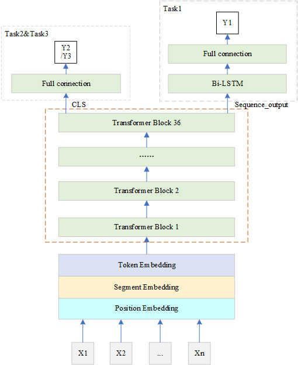

## 实验环境

CUDA Version: 11.0      Driver Version: 450.80.02   GPU: TITAN XP 

Python: 3.7.9				pytorch: 1.7.0   					  OS: ubuntu 20.04

安装依赖包

```
pip install -r requirements.txt
```

## 解决方案及算法说明

*   数据预处理：数据清洗（剔除非中文，非英文，非数字符号）

*   文本截断：通过对各任务句子长度的分析，选择句子长度256作为截断标准，不足补0

*   数据输入

​	由于任务二和任务三存在较大的类别不均衡问题，因此训练集和验证集的划分采用StratifiedKFold交叉验证。由于需要多任务学习，因此模型的输入增加了任务标识dataset_ids。因此模型的输入可以表示为（token_ids,  segment_id, mask, dataset_ids）。其中任务一由于是句子对任务，token=[cls+句子1+sep+句子2]，其余两个任务token=[cls+句子+sep]

*   模型结构

​	采用硬共享模式，三个任务共享隐藏层，其中任务一使用预训练模型的最后一层作为bi-lstm层的输入，其余两个任务使用预训练模型最后一层的[cls]作为全连接层的输入。在每个训练步，模型会从任务列表中随机选择一个任务进行优化，我们利用早停法，逐步增加dropout，,最终可以实现在验证集上63.03%的F1值。模型的结构可以参照如下：



#### 其他trick尝试

*   进一步预训练

我们将赛事提供的所有数据以及一些外部数据一起做无监督的预训练，发现此时模型过拟合的会更快，效果没有明显提升。由于时间关系，我们没能尝试有监督的预训练以及试验不同step保存的模型

*   对抗攻击

 在bert-base，roberta-wwm-large等预训练模型中使用会有小幅度提升。由于显存限制，无法在36层的预训练模型上使用。而如果减少下游输出层的参数（去掉lstm层）增加上对抗攻击，效果没有进一步提升。

*   伪标签：没有提升

*   focal loss和数据增强：仅在小模型上进行了尝试，没有明显提升

## 经验总结

选择一个合适的预训练模型非常重要。在本次比赛中，我们分别尝试了bert-base，roberta-wwm-large,UER-wwm-36等预训练模型。更大的模型，质量更高的语料确实能带来1-2个点的提升。

文本长度很重要。由于情感分析和新闻分类任务存在长文本，因此最初长度设为为128提交的准确率很难超过62%，而换用更大的长度（256）可以带来0.5%以上的提升。

Dropout的设置很重要。由于预训练模型很大，容易过拟合，因此调参显得更加重要。我们发现下游的输出层不需要设计太复杂，简单的全连接层足以取得好的结果。此外我们发现在一个epoch内评估模型的次数越多，越容易找到更好的参数分布。因此在实际训练过程中，我们利用早停法，逐步增加dropout的值，每100个batch评估一次模型，最终能在原有模型的基础上再提高1%-1.5%。

## 项目目录说明

```
├── readme.md          		        #算法描述
├── requirements.txt			    #依赖包
│  
├── code
│   ├── generate_input.py          	#转化为模型可接受的输入形式
│   ├── preprocess.py				#数据清洗
│   ├── run.py						#程序入口
│   ├── test.sh                     #测试脚本
│   ├── train.sh        		    #训练脚本
│   ├── train_eval.py				#训练和评估
│   ├── utils.py					#一些辅助函数
│   │  
│   └── models
│       └── bert.py 				#模型结构
│          
├── prediction_result			
├── tcdata
└── user_data
    ├── model_data                   #训练好的模型
    │   └── bert-12.31.ckpt
    │      
    ├── raw_data					 #由于提供的csv文件读取不全，转化为txt，以及生成清洗     
    │   │							 #后的_new.txt文件和标签_class.txt文件	       
    │	├── OCEMOTION_a.txt
    │   ├── OCEMOTION_class.txt
    │   ├── OCEMOTION_train.txt
    │   ├── OCEMOTION_train_new.txt
    │   ├── OCNLI_a.txt
    │   ├── OCNLI_class.txt
    │   ├── OCNLI_train.txt
    │   ├── OCNLI_train_new.txt
    │   ├── TNEWS_a.txt
    │   ├── TNEWS_class.txt
    │   ├── TNEWS_train.txt
    │   └── TNEWS_train_new.txt
    │      
    ├── Roberta-wwm-36               #预训练模型，若重新训练，会在该目录下生成bert.ckpt文件
    │    ├── bert_config.json
    │    ├── pytorch_model.bin
    │    └── vocab.txt
    │      
    └── tmp_data					 #可以直接被Dataloader加载的数据
         ├── B_emotion_256.txt
         ├── B_nli_256.txt
         ├── B_tnews_256.txt
         ├── test_emotion256.txt
         ├── test_news256.txt
         ├── test_nli256.txt
         ├── train_emotion_clear.txt
         ├── train_news_clear.txt
         └── train_nli_clear.txt
          
```

## 数据预处理

由于csv读取不全，因此首先将下载的数据集保存为.txt文件，构造对应任务的标签文件*_class.txt，数据保存在user_data/raw_data目录下

*   数据清洗

**注：已提供转化好的数据，无需运行**

```
python preprocess.py
```

清洗后的数据将保存到user_data/raw_data目录下,以*_new.txt结尾

*   生成模型可接受的输入格式

在训练前，我们先将训练数据和测试数据转化为如下模型可接受的输入形式

（token_ids, segment_id, mask, dataset_ids)

其中dataset_labels_ids表示任务的id号，ocnli,  tnews, emotion依次为1,2,3

生成的json格式数据保存到user_data/raw_data目录下以*_clear.txt或*_256.txt结尾的文件中

**注：已提供转化好的数据，无需运行**

```
python generate_input.py
```

## 预训练模型

Chinese 36-layers RoBERTa-WWM：https://github.com/dbiir/UER-py

下载的预训练模型，bert_config.json, vocab.txt文件保存在user_data/Roberta-wwm-36中

## 模型训练

```
cd code
sh train.sh
```

#### 训练方式

*   阶段一

最初dropout设置为0.3，训练3个epoch，每个epoch评估10次。

*   阶段二

dropout改为0.6，改为每100次评估一次（用于保存模型），当超过2000个batch未能提升时，停止训练。此时模型在验证集的准确率可达63%以上

训练好的模型保存至data/Roberta-wwm-36中，此模型在A榜提交为64.74%，B榜为66.87%

**注**：由于此前A榜的提交结果154行忘记设置random.seed()，因此重新训练可能会有偏差，可以尝试多个不同的随机种子如random.seed(1),random.seed(1234)
**注**：若重新训练，模型将会保存在user-data/Roberta-wwm-36/bert.ckpt中。故此时在进行inference之前，需先修改run.py第115行代码为config.save_path='../user_data/Roberta-wwm-36/bert.ckpt'

## 模型评估

```
cd code
sh test.sh
```
